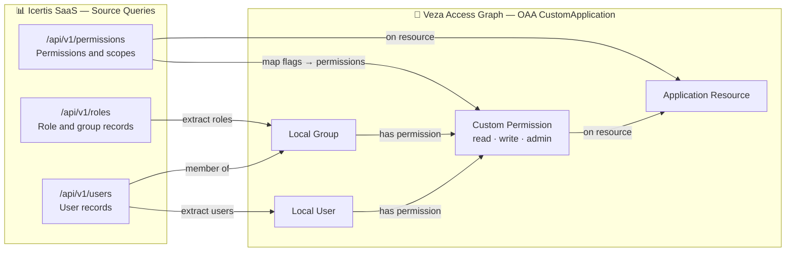

# Icertis SaaS → Veza OAA Integration

This connector queries the Icertis SaaS application via HTTPS and maps the returned identity and permission data into a Veza OAA CustomApplication payload.

## Overview

This integration is intentionally built for SaaS access patterns, not CSV import. It reads the application directly through query endpoints and pushes the transformed data into Veza as:

- Local users
- Local roles / groups
- Application resources
- Custom permissions

### Entity model

| Source entity | Veza entity | Notes |
|---|---|---|
| User records | Local User | Email or username used as identity |
| Role records | Local Group | Role name becomes group assignment |
| Permission objects | Custom Permission | Maps to read/write/admin operations |
| Resource references | Application Resource | Resource or object ID becomes a resource node |

## Entity relationship map



## Authentication and query flow

The connector supports either of these authentication patterns:

1. OAuth2 client credentials
   - `ICERTIS_CLIENT_ID`
   - `ICERTIS_CLIENT_SECRET`
   - `ICERTIS_TOKEN_URL`
   - `ICERTIS_SCOPE`

2. Static bearer token or API key
   - `ICERTIS_API_TOKEN`
   - `ICERTIS_API_KEY`

It then queries the configured endpoints under `ICERTIS_BASE_URL`:

- `/api/v1/users`
- `/api/v1/roles`
- `/api/v1/permissions`

The script accepts overrides via CLI flags so the endpoints can be customized for different environments.

## Requirements

- Python 3.9+
- Access to the Icertis SaaS tenant
- Veza URL and API key
- Valid read access to the user, role, and permission APIs

## Quick start

```bash
cd integrations/icertis
python3 -m venv venv
./venv/bin/pip install -r requirements.txt
cp .env.example .env
chmod 600 .env
# edit the values in .env
./venv/bin/python3 icertis.py --env-file .env --dry-run --save-json --log-level DEBUG
```

## CLI usage

```bash
./venv/bin/python3 icertis.py --env-file .env --dry-run --save-json
```

### Supported arguments

| Argument | Default | Description |
|---|---|---|
| `--env-file` | `.env` | Location of the environment file |
| `--veza-url` | from env | Veza tenant URL |
| `--veza-api-key` | from env | Veza API key |
| `--base-url` | from env | Icertis SaaS app base URL |
| `--api-token` | from env | Bearer token |
| `--api-key` | from env | API key |
| `--client-id` | from env | OAuth client ID |
| `--client-secret` | from env | OAuth client secret |
| `--token-url` | from env | OAuth token URL |
| `--scope` | from env | OAuth scope |
| `--users-path` | `/api/v1/users` | Query path for user records |
| `--roles-path` | `/api/v1/roles` | Query path for role records |
| `--permissions-path` | `/api/v1/permissions` | Query path for permission records |
| `--dry-run` | false | Build payload without pushing to Veza |
| `--save-json` | false | Save payload to `icertis_payload.json` |
| `--log-level` | `INFO` | Logging level |
| `--provider-name` | `Icertis` | Veza provider name |
| `--datasource-name` | `Icertis` | Veza datasource name |

## Example live push

```bash
./venv/bin/python3 icertis.py --env-file .env --log-level INFO
```

## Security notes

- Keep `.env` permissions at `600` with `chmod 600 .env`
- Never commit live secrets or tokens to source control
- Use a dedicated Veza API key with read/write access only to the target environment

## Troubleshooting

- If the connector fails with `ICERTIS_BASE_URL is required`, confirm the SaaS URL in `.env`
- If the API returns `401` or `403`, validate the token, client ID, or API key
- If the source schema differs from the standard fields, override the endpoint paths and inspect the JSON response
- If the script exits before push, run with `--dry-run --save-json --log-level DEBUG` to inspect the payload

## Files in this directory

- `icertis.py` — main Veza OAA query-based connector
- `.env.example` — environment template for SaaS and Veza settings
- `requirements.txt` — Python module dependencies
- `install_icertis.sh` — installer script for local setup
- `preflight_icertis.sh` — preflight validation for deployment readiness
- `samples/` — placeholder example response files and guidance
